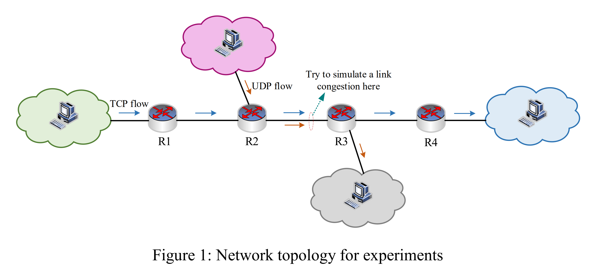

### 场景

你需要模拟如图 1 所示的多跳网络。具体来说，相邻的主机和路由器均通过带宽为 10Mbps、延迟为 5ms 的点对点链路连接。在运行过程中，绿色云团中的每台主机通过路径（R1、R2、R3、R4），使用 TCP 连接到蓝色云团中的服务器。另外，TCP 采用了 newReno、Reno 和 Vegas 等拥塞算法。同时，紫色云团中的每台主机通过路径（R2，R3）以不同的发送速率向灰色云团中的接收端发送 UDP 数据包。UDP 会造成（R2、R3）链路间不同级别的拥塞，从而影响 TCP 的 QoS 性能。

### 实验参数调整

在实验过程中可以调整下列实验参数：

- UDP 发送速率
- TCP 发送速率
- TCP 参数，包括但不限于：缓冲区大小、Nagle 算法和 MTU
- 路由器中的队列缓冲区大小

## 目标

你需要测试绿色云团主机与蓝色云团服务器之间的 QoS 性能，包括时延、丢包率等。

通过测试，需要实现以下目标：

- 了解在不同的参数配置下 TCP 拥塞控制过程的动态变化。
- 了解 TCP QoS 性能的局限性并找出导致 TCP 性能衰退的内在原因。
- 学习如何使用 NS-3 进行网络实验研究。
- 学习如何使其他研究人员可以重复你的实验，这要求任务代码打包提交。

## 提交内容和交付成果

你需要写一份关于实验的技术报告。 该报告必须包含四个部分：

- 关于你的实验愿景/目标的陈述，例如：如果你想研究严重拥塞链路下 TCP 变化的 QoS 性能。
- 实验设置，包括所使用的参数。
- 实验中可以通过图形或表格表达的数值结果，你必须以明确的方式陈述你在这些结果中的发现。（绘制图形的一种简单方法是使用 Excel 或 MATLAB）
- 关于你的实验的结论。 

此外，你需要提交最终的源代码。同时，应准备一个自述文件，为其他人重复你的实验提供指导。 例如，如何运行你的代码？ 就像通过 “./waf --run scrap/xxx” 执行命令一样。

总结来说，提交的内容包括以下几个部分：

- 一份技术报告
- 源代码文件
- 自述文件

你需要将上述提交材料用 rar/tar.bz2/tar.gz/zip 压缩打包。然后，你应该通过电子邮件将压缩文件发送到 zhouby@zhejianglab.com ，文件标题应为 “ATCN-Programs-[你的名字]-[你的学号]”，例如“ATCN-Programs-张三-12345”和“ATCN程序张三-12345.rar”。请注意，违反此类标题命名约定的文件将不会视为你的作业。